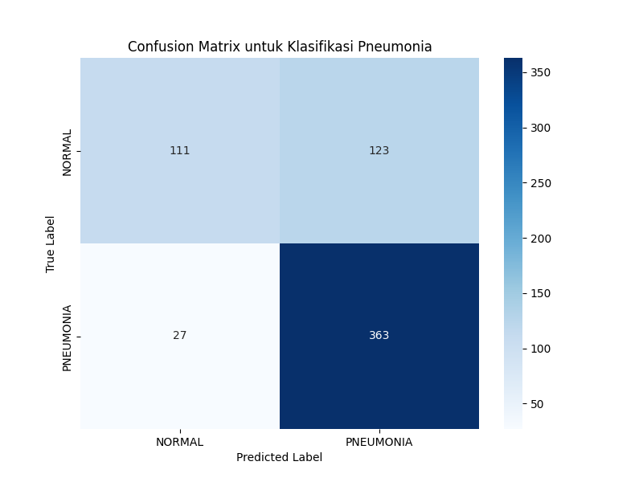
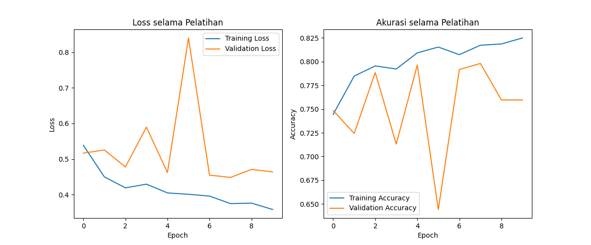
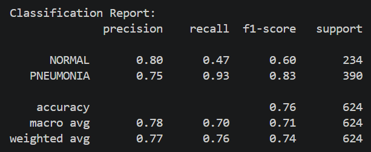
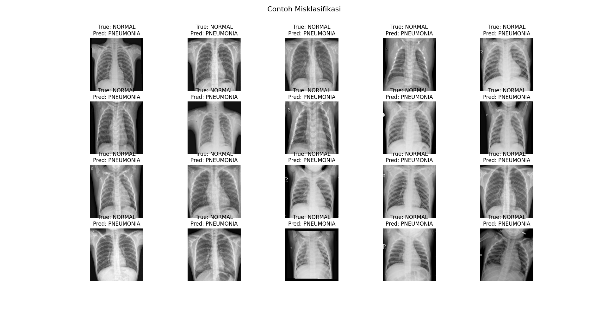

# Pneumonia Classification using ResNet50

## Overview
This project implements transfer learning using ResNet50 for binary classification of chest X-ray images into:

- NORMAL
- PNEUMONIA

The model uses TensorFlow/Keras with data augmentation techniques to improve generalization performance on medical image datasets.

## Tech Stack

### Language
- Python

### Framework & Libraries
- TensorFlow
- Keras
- NumPy
- Scikit-learn
- Matplotlib
- Seaborn

### Model Architecture
- ResNet50

## Dataset
Dataset used:
Chest X-Ray Images (Pneumonia)

Source:
https://www.kaggle.com/datasets/tolgadincer/labeled-chest-xray-images

Download the dataset manually and extract it into:

```bash
pneumonia-classification-resnet50/
│
├── chest_xray/
│   ├── train/
│   └── test/
```

## Features
- Transfer Learning using ResNet50
- Feature Extraction
- Data Augmentation
- Binary Image Classification
- Confusion Matrix Visualization
- Classification Report
- Training Accuracy & Loss Visualization
- Misclassification Analysis

## Results
- Test Accuracy: 76%
- High recall for PNEUMONIA detection
- Transfer learning successfully applied on chest X-ray dataset

## Visualizations

### Confusion Matrix


### Training Accuracy & Loss



### Classification Report
<p align="center">
  
</p>

### Misclassified Samples


## Installation

Install dependencies:

```bash
pip install -r requirements.txt
```

---

## Run

```bash
python src/train.py
```